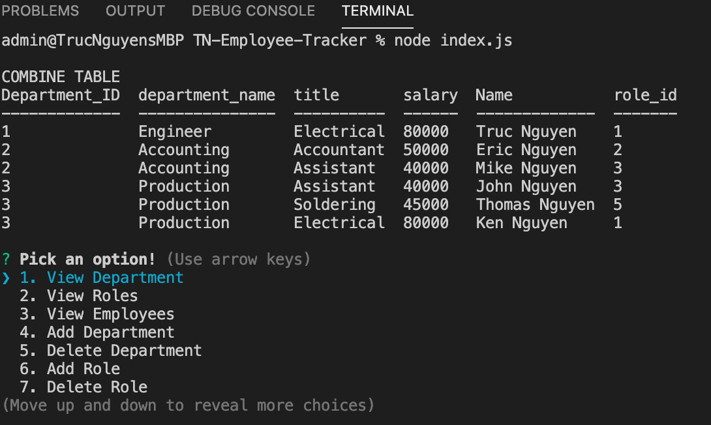

# TN-Employee-Tracker

## Table Content
- [Description](#Description)
- [User Story](#User-Story)
- [Employee Tracker Use Option List](#Employee-Tracker-Use-Options)
- [Link](#Link)
- [Screenshot](#Screenshot)

## Description
```
The Employee Tracker application can be use to track all employee in your company. Application can view, add, Remove or update employee, roles and departments. 
```

## User Story
```
As a business owner
I want to be able to view and manage the departments, roles, and employees in my company
So that I can organize and plan my business
```

## Employee Tracker Use Options
* View departments, roles, employees

* Add departments, roles, employees

* Delete departments, roles, and employees

* Update employee roles

## Link
* [Demo Video](https://youtu.be/H8ejAXODX0Q)
* [Repo Link](https://github.com/trucn0215/TN-Employee-Tracker)

## Screenshot
### Screenshot the List of Tracker App Options
